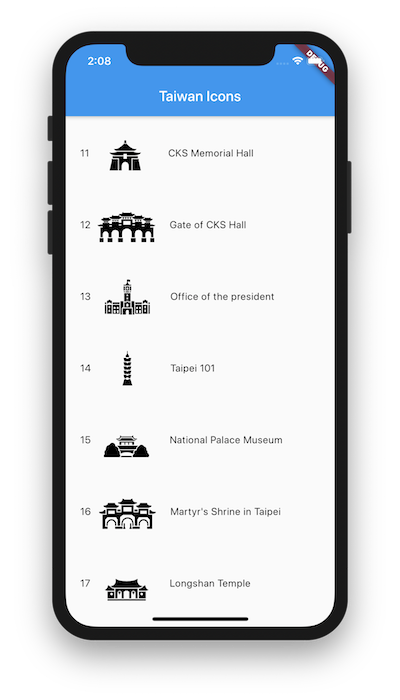

# twicon

twicon helps to integrate [free icons](https://www.twicon.page/icons.html) of
Taiwan from [TW Icon Fonts](https://www.twicon.page), into your Flutter apps,

These free icons are covering the topics like sights, products, traffic and so
on. They let you to promote your favorite places and cuisines in Taiwan easily
within your apps.

These icons are designed by a Japanese designer, holoko, and an English designer
Rob. For further information, please visit [TW Icon Fonts](https://www.twicon.page).

## Usage

Adds `twicon` to your pubspec file, run `futter packages get`, then you can
import the package:

``` dart
import 'package:twicon/twicon.dart';
```

Then you can use these icons in widgets like `Icon`, `IconButton` and so on:

``` dart
Icon(TaiwanIcons.taipei101),
```

You can also run the example project, to see view the icons included.


